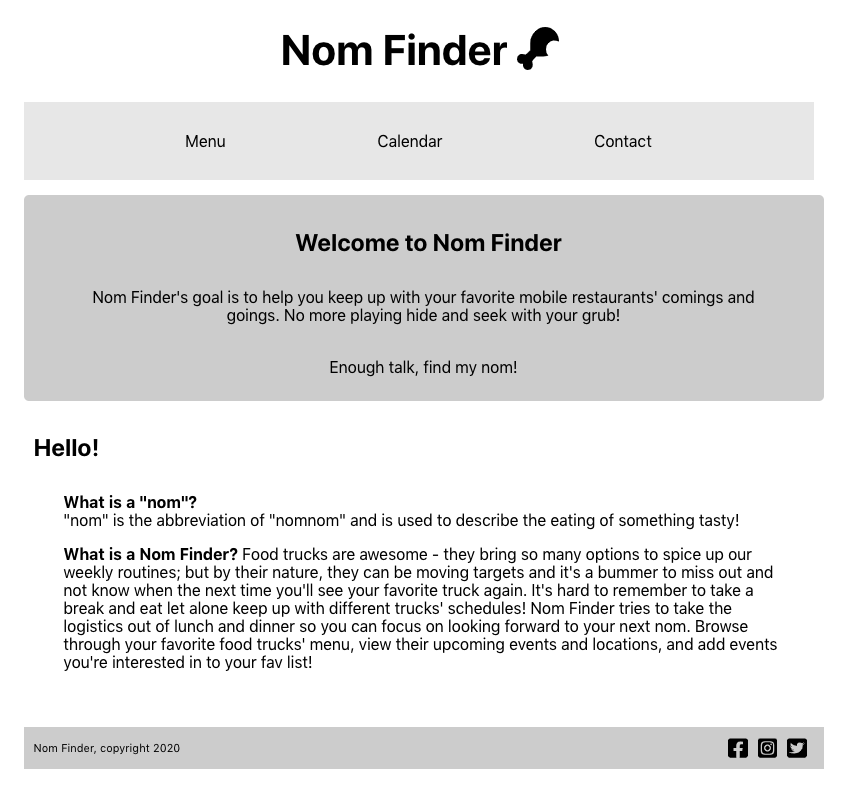
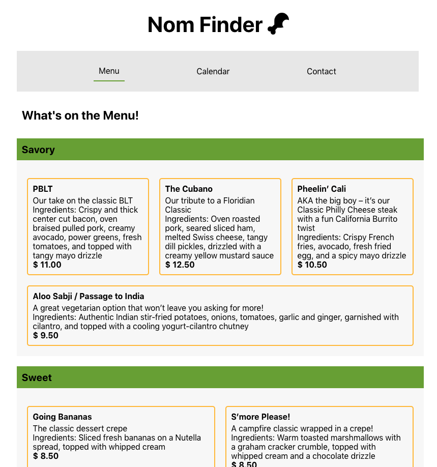
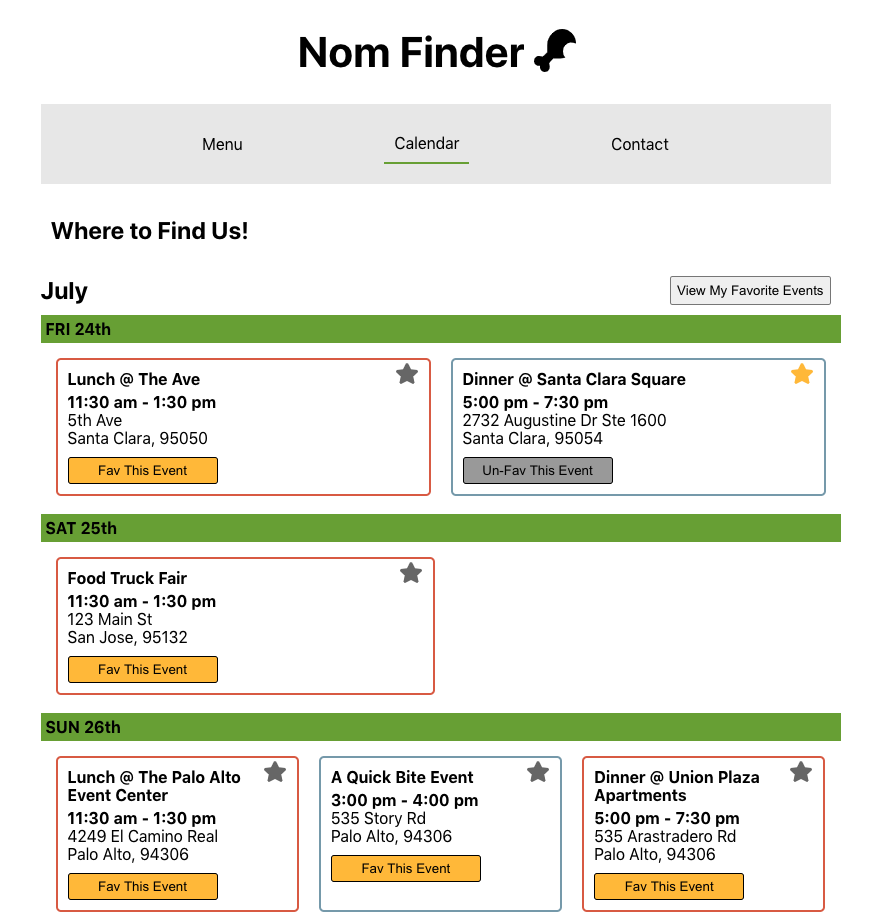
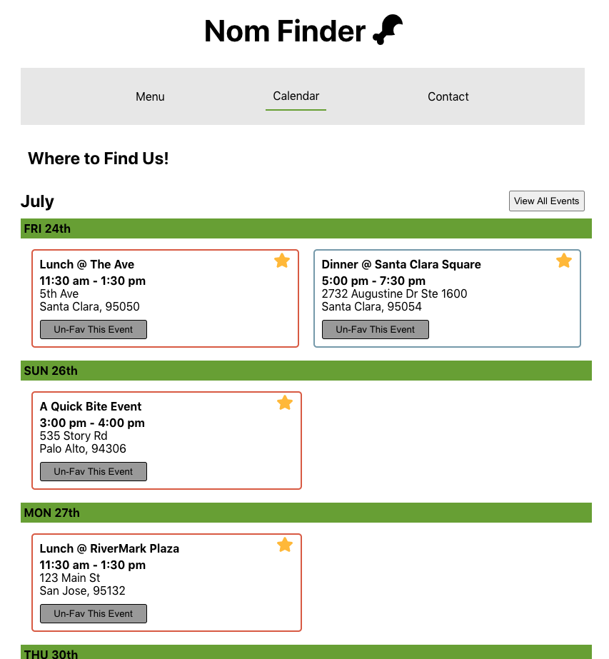
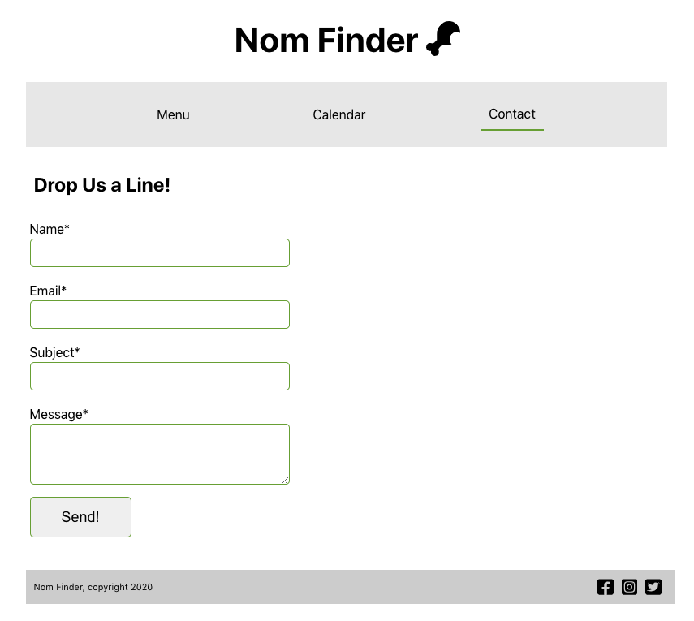

# Summary

Title: Nom Finder

Description: A light weight app that focuses on tracking and organizing one's favorite food truck events.

## Purpose

To eventually provide a directory of food trucks' menus and events in one easy to access location so anyone can create an account and track when their favorite truck will be in their area next.

## Screenshots
Homepage:

View Menu Items:

Calendar, View all Events:

Calendar, View My Favorite Events:

Contact Page:

## Built With

* HTML5/CSS3
* React/Node
* Formspree

## Features

* View Menu Options
* View Food Truck Events & Details
* Fav and Un-fav Events
* View All Events or View Your Favorite Events
* Contact Form

## Demo

- [Live Demo](https://my-nom-finder.vercel.app/)